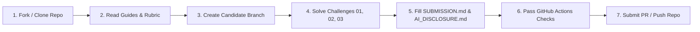

<div align="center">

# 🚀 GDG on Campus SVEC — Organizer Selection 4.0
### Practical Technical Assessment Repository

[](https://gdg.community.dev/)
[](#-24-hour-assessment-model)
[](evaluation/RUBRIC.md)
[](docs/AI_USAGE_POLICY.md)

<p align="center">
  <strong>Welcome to the technical evaluation phase for GDG on Campus Sri Venkateswara College of Engineering (SVEC) Core Team 4.0.</strong><br>
  This assessment is designed to evaluate your practical engineering, problem-solving, architectural thinking, and community-readiness.
</p>

---

</div>

## 📌 Overview

As part of the **GDG on Campus SVEC 4.0 Organizer Selection**, this repository hosts the **GitHub-Based Practical Technical Assessment**. 

Being a Google Developer Groups (GDG) Organizer is not just about writing code in isolation—it is about **ownership, technical leadership, communication, problem-solving, and shipping real-world value** for the student developer community.

This assessment is intentionally designed to reflect authentic engineering challenges faced by developers and community leaders, rather than academic trivia or pure competitive programming puzzles.

> [!NOTE]
> The organizer selection process consists of two distinct components:
> 1. **Part 1 — Concept & Domain MCQ Assessment** (Conducted separately via Google Forms).
> 2. **Part 2 — GitHub Practical Technical Assessment** (This repository).
>
> *This repository contains solely the practical assessment infrastructure.*

---

## ⏱️ 24-Hour Assessment Model

The practical assessment operates on a strict **24-hour completion window** starting from the moment you access the repository or the assessment round is officially announced.

| Stage | Expected Duration | Focus Area |
| :--- | :--- | :--- |
| **Stage 1: Setup & Exploration** | 30 – 45 mins | Forking/cloning, reading documentation, choosing stack |
| **Stage 2: Challenge 01 (Debugging)** | 2 – 3 hours | Root-cause analysis, bug fixing, regression tests |
| **Stage 3: Challenge 02 (Problem Solving)** | 3 – 4 hours | Algorithmic logic, edge cases, unit testing |
| **Stage 4: Challenge 03 (Practical Project)** | 8 – 10 hours | End-to-end building, architecture, API/UI, documentation |
| **Stage 5: Documentation & AI Disclosure** | 1 – 2 hours | Finalizing `SUBMISSION.md` and `AI_DISCLOSURE.md` |
| **Stage 6: Review & Push** | 30 mins | Verifying automated checks, clean Git history, submission |

---

## 🧩 Assessment Structure

The assessment is divided into three distinct challenges located under [`assessment/`](assessment/):

```
assessment/
├── README.md                      # Detailed challenge overview & instructions
├── challenge-01-debugging/        # Challenge 01: Debugging & Root-Cause Analysis (15 pts)
├── challenge-02-coding/           # Challenge 02: Core Engineering & Problem Solving (20 pts)
└── challenge-03-practical/        # Challenge 03: Practical GDG Community Solution (35 pts)
```

### [Challenge 01: Debugging & Root-Cause Analysis](assessment/challenge-01-debugging/README.md) `(15 Points)`
- **Core Objective:** Diagnose, isolate, and fix non-trivial bugs in a realistic asynchronous event management system.
- **Skills Evaluated:** Codebase comprehension, methodical root-cause analysis, regression testing, and clear bug documentation.

### [Challenge 02: Coding & Problem Solving](assessment/challenge-02-coding/README.md) `(20 Points)`
- **Core Objective:** Implement a robust, algorithmic scheduling & session allocation engine for large-scale campus tech summits.
- **Skills Evaluated:** Data structures, computational complexity, constraint validation, defensive programming, and edge-case handling.

### [Challenge 03: Practical GDG Engineering Project](assessment/challenge-03-practical/README.md) `(35 Points)`
- **Core Objective:** Architect and build a functional, real-world developer community utility (e.g., Event Check-in & Badge Generator, Workshop RSVP Platform, or Community Project Showcase).
- **Skills Evaluated:** Full-stack/backend/frontend architecture, Git hygiene, API design, UX, documentation, and maintainability.
- **Tech Stack:** **100% Candidate's Choice** (React, Next.js, Vue, Node.js, Python/FastAPI, Go, Java/Spring, Flutter, etc.).

---

## 🛠️ Candidate Workflow

Follow these steps to complete and submit your assessment:



1. **Access & Setup:** Fork or clone this repository to your personal GitHub account. Set up your local development environment.
2. **Review Guides:** Thoroughly read:
   - [Candidate Guide](docs/CANDIDATE_GUIDE.md)
   - [Evaluation Rubric](evaluation/RUBRIC.md)
   - [AI Usage Policy](docs/AI_USAGE_POLICY.md)
3. **Branching:** Create a feature branch named `submission/<your-github-username>` (e.g., `submission/octocat`).
4. **Implement Solutions:**
   - Complete **Challenge 01** in `assessment/challenge-01-debugging/`.
   - Complete **Challenge 02** in `assessment/challenge-02-coding/`.
   - Complete **Challenge 03** in `assessment/challenge-03-practical/`.
5. **Fill Documentation:**
   - Copy and complete [`starter/SUBMISSION.md`](starter/SUBMISSION.md) to your submission root or designated location.
   - Copy and complete [`starter/AI_DISCLOSURE.md`](starter/AI_DISCLOSURE.md) documenting any tools used.
6. **Verify Automated Workflows:**
   - Ensure repository structure and automated checks pass in GitHub Actions (`.github/workflows/`).
7. **Submit:**
   - Push your branch to your repository or open a Pull Request as instructed in the [Candidate Guide](docs/CANDIDATE_GUIDE.md).

---

## ⚖️ Evaluation Framework (100 Points)

Every submission is evaluated against an objective, multi-dimensional rubric:

| Criteria | Maximum Points | Focus |
| :--- | :---: | :--- |
| **Challenge 01: Debugging & RCA** | 15 | Root-cause identification, fix accuracy, regression tests |
| **Challenge 02: Coding & Algorithms** | 20 | Logic correctness, efficiency, edge cases, unit tests |
| **Challenge 03: Practical Engineering** | 35 | Functionality, architecture, API/UI design, completeness |
| **Code Quality & Maintainability** | 10 | Clean code principles, modularity, readability, linting |
| **Git & GitHub Practices** | 5 | Atomic commits, descriptive commit messages, branch hygiene |
| **Documentation & Clarity** | 5 | Setup instructions, architecture notes, decision logs |
| **Automated & Unit Testing** | 5 | Test suite coverage, test quality, mocking/assertions |
| **Technical Explanation & AI Mastery** | 5 | Depth of understanding, AI disclosure transparency, reasoning |
| **Total** | **100** | |

*See full scoring criteria in [evaluation/RUBRIC.md](evaluation/RUBRIC.md).*

---

## 🤖 AI Usage & Modern Developer Tools

We recognize that modern software engineering incorporates AI tools (Google Gemini, ChatGPT, Claude, GitHub Copilot, Cursor, etc.). **Using AI tools is permitted**, provided you adhere to our guidelines:

- **Transparency:** You must declare any AI tools used in [`AI_DISCLOSURE.md`](starter/AI_DISCLOSURE.md).
- **Comprehension & Verification:** You are 100% accountable for every line of code submitted. You must understand, verify, and be able to defend your implementation during the technical interview.
- **No Blind Copy-Pasting:** Submissions with unverified AI hallucinations, broken context, or unexplained patterns will receive heavy deductions.

*Read the full policy in [docs/AI_USAGE_POLICY.md](docs/AI_USAGE_POLICY.md).*

---

## 🔒 Security & Honor Code

> [!CAUTION]
> **Never commit confidential information or credentials!**
> - **DO NOT** commit `.env` files with actual API keys, database connection strings with real passwords, private keys, or tokens.
> - Provide `.env.example` templates with placeholder values instead.
> - Ensure all personal data used in tests is mock/dummy data.

- **Original Work:** All submissions must represent your individual effort. Plagiarism or copying between candidates will result in immediate disqualification.
- **Fairness:** If you encounter ambiguities or issues in challenge descriptions, open an issue using the [Bug Report Template](.github/ISSUE_TEMPLATE/bug-report.md) or contact the organizing team.

---

## 📂 Repository Navigation

```
├── README.md                          # Main landing page (You are here)
├── CONTRIBUTING.md                    # Guidelines for candidates and maintainers
├── LICENSE                            # MIT Open Source License
├── .gitignore                         # Comprehensive ignore rules
├── .github/
│   ├── workflows/
│   │   ├── validate-submission.yml    # Structural and security automated validation
│   │   └── code-quality.yml           # Multi-stack linting and test automation
│   └── ISSUE_TEMPLATE/
│       └── bug-report.md              # Template for reporting assessment issues
├── assessment/
│   ├── README.md                      # Detailed challenge overview & time management
│   ├── challenge-01-debugging/        # Challenge 01 instructions and workspace
│   ├── challenge-02-coding/           # Challenge 02 instructions and workspace
│   └── challenge-03-practical/        # Challenge 03 instructions and workspace
├── starter/
│   ├── README.md                      # Guide to submission templates
│   ├── SUBMISSION.md                  # Standard submission summary template
│   ├── AI_DISCLOSURE.md               # Standard AI disclosure template
│   └── DEBUG_REPORT_TEMPLATE.md       # Root-cause analysis template for Challenge 01
├── evaluation/
│   ├── RUBRIC.md                      # 100-point scoring framework
│   └── EVALUATOR_GUIDE.md             # Organizer evaluation & anti-bias guide
└── docs/
    ├── CANDIDATE_GUIDE.md             # Complete applicant handbook
    ├── ORGANIZER_GUIDE.md             # Internal operations guide for GDG Leads
    └── AI_USAGE_POLICY.md             # Comprehensive AI usage rules
```

---

<div align="center">
  <p>Built with ❤️ by <strong>GDG on Campus SVEC 3.0 Core Team</strong> for the future leaders of <strong>GDG on Campus SVEC 4.0</strong>.</p>
  <p><em>"Together, we build. Together, we lead."</em></p>
</div>
