# 🎯 Technical Assessment Challenges Overview

Welcome to the core challenges of the **GDG on Campus SVEC 4.0 Organizer Selection**.

The assessment is divided into three distinct engineering challenges, designed to measure your end-to-end capabilities as a software engineer and community technology leader.

---

## 📊 Challenge Summary Matrix

|  Challenge  | Title                         | Focus Area                                                       | Max Score | Recommended Time | Directory                                                      |
| :----------: | :---------------------------- | :--------------------------------------------------------------- | :-------: | :--------------: | :------------------------------------------------------------- |
| **01** | **Debugging & RCA**     | Diagnosis, Root-Cause Analysis, Concurrency/State, Unit Testing  |  15 pts  |   2 – 3 Hours   | [`challenge-01-debugging/`](challenge-01-debugging/README.md) |
| **02** | **Coding & Algorithms** | Algorithmic Problem Solving, Constraints, Edge Cases, Complexity |  20 pts  |   3 – 4 Hours   | [`challenge-02-coding/`](challenge-02-coding/README.md)       |
| **03** | **Practical Project**   | System Architecture, Full-Stack/Backend/UI, Real GDG Solution    |  35 pts  |  8 – 10 Hours  | [`challenge-03-practical/`](challenge-03-practical/README.md) |

---

## 🕒 Pacing & Time Management (24-Hour Window)

The 24-hour deadline is designed to simulate a realistic development sprint. We do **not** expect you to work 24 hours continuously without sleep; rather, we assess your ability to **prioritize, architect pragmatically, and ship quality code within realistic constraints**.

```mermaid
gantt
    title Suggested 24-Hour Assessment Sprint Timeline
    dateFormat  HH:mm
    axisFormat  %H:%M
    section Setup & Reading
    Repo Setup & Guide Review      :00:00, 00:45
    section Challenge 01
    Debugging & RCA Report         :00:45, 03:15
    section Challenge 02
    Algorithm Implementation & Tests:03:15, 07:00
    section Break & Rest
    Rest / Sleep / Meals           :07:00, 14:00
    section Challenge 03
    Practical GDG Engineering MVP  :14:00, 22:00
    section Wrap-Up & Submission
    Documentation, AI Log & PR     :22:00, 24:00
```

---

## 💡 Tech Stack Freedom & Flexibility

We believe great engineers and community leads adapt the right tool for the job.

- **Challenge 01:** May be solved in JavaScript/TypeScript, Python, Go, or your preferred language using the provided starter scenarios.
- **Challenge 02:** May be implemented in any major programming language (Python, TypeScript/JavaScript, C++, Java, Go, Rust, Kotlin).
- **Challenge 03:** **100% stack freedom** (React, Next.js, Vue, Svelte, Node.js, Express, FastAPI, Django, Flask, Go, Java Spring Boot, Flutter, etc.).

---

## 🚀 Navigation

- 🐞 [Go to Challenge 01: Debugging](challenge-01-debugging/README.md)
- ⚙️ [Go to Challenge 02: Coding &amp; Problem Solving](challenge-02-coding/README.md)
- 🛠️ [Go to Challenge 03: Practical GDG Solution](challenge-03-practical/README.md)
- 📋 [Go to Starter Templates](../starter/README.md)
- ⚖️ [Review Evaluation Rubric](../evaluation/RUBRIC.md)
