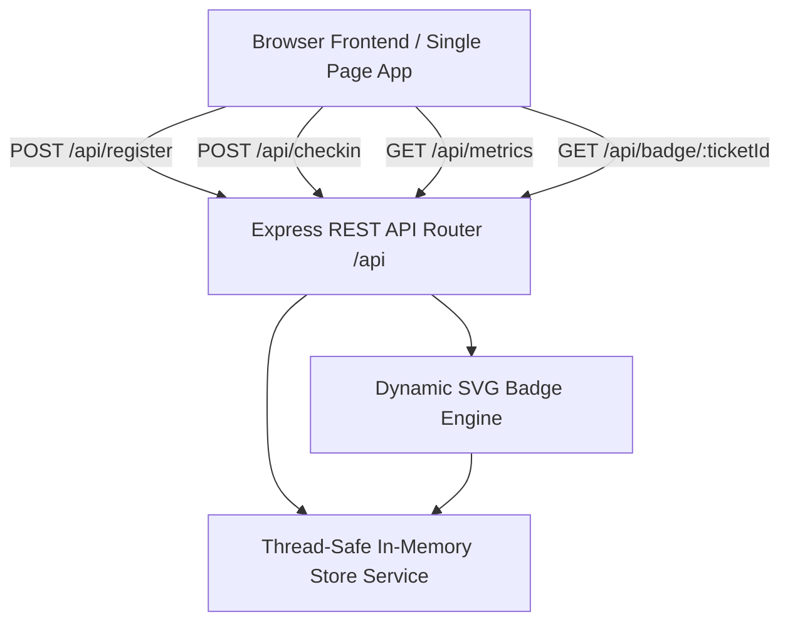

# 🎟️ Challenge 03 — GDG Event Check-In & Dynamic Social Badge Hub
**Track:** Track A — Event Check-In & Dynamic Social Badge Hub
**Author:** Candidate (GDG on Campus SVEC 4.0 Organizer Selection)
**Tech Stack:** Node.js, Express, TypeScript, Pure SVG / Canvas Rendering, Vanilla HTML5/CSS3

---

## 📌 Project Overview

The **GDG Event Check-In & Dynamic Social Badge Hub** is an end-to-end community utility built specifically for GDG DevFest and campus tech summits at Sri Vasavi Engineering College (SVEC).

### Real Community Problem Solved:
1. **Entrance Bottlenecks:** For large GDG summits (500+ attendees), manual registration lookups create massive queues and entrance chaos.
2. **Duplicate Check-In Risks:** Attendees sharing badges or double-checking in inflate attendance counts and compromise accurate certificate distribution.
3. **Social Hype & Engagement:** Students want personalized, high-resolution social badges to share on LinkedIn, Twitter, and WhatsApp to celebrate their participation.
4. **Organizer Blindspots:** Core team organizers need real-time visibility into attendance counts, department participation rates, and check-in velocity.

---

## 🏗️ Architecture & Component Design



### Modular Components:
- **`src/models/types.ts`:** Domain models for Attendees, Tickets, Check-In Records, Metrics, and Badges.
- **`src/services/store.service.ts`:** Thread-safe state repository managing indexing (by Ticket ID, Roll Number, and Email), atomic check-in transitions, and real-time velocity metrics.
- **`src/services/badge.service.ts`:** Programmatic SVG badge generation engine applying Google Developer branding (#4285F4, #EA4335, #FBBC04, #34A853), personalized metadata, verified attendee seals, and social tags.
- **`src/controllers/attendee.controller.ts`:** Validates registrations, manages attendee lists, and serves badge assets.
- **`src/controllers/checkin.controller.ts`:** Rapid ticket validation, duplicate check-in defense (HTTP 409), and live dashboard metrics.
- **`src/routes/api.routes.ts`:** Declarative routing mapping HTTP operations to controller actions.
- **`src/public/index.html`:** Clean, responsive, glassmorphic UI featuring tabs for registration, organizer terminal, live analytics, and interactive badge customizer.

---

## 🚀 Setup & Local Execution Guide

Follow these exact steps to install and run the application locally:

### 1. Install Dependencies
```bash
cd assessment/challenge-03-practical
npm install
```

### 2. Configure Environment (Optional)
```bash
cp .env.example .env
```
Default configuration runs on port `3000` with zero external database dependencies required.

### 3. Run Automated Integration Tests
```bash
npm test
```
Executes the comprehensive 8-scenario test suite covering registration, validation, duplicate prevention, rapid check-in, duplicate check-in blocking, metrics, and SVG badge rendering.

### 4. Run TypeScript Compilation & Linter Check
```bash
npm run lint
npm run build
```

### 5. Start the Application
```bash
npm start
```
Open your browser and navigate to:
**`http://localhost:3000`**

---

## 📡 REST API Specification

| Method | Endpoint | Description | Status Codes |
| :--- | :--- | :--- | :--- |
| `POST` | `/api/register` | Register a new attendee and issue ticket | `201 Created`, `400 Bad Request` |
| `GET` | `/api/attendees` | Search and filter registered attendees | `200 OK` |
| `GET` | `/api/attendees/:ticketId` | Fetch attendee details by ticket ID | `200 OK`, `404 Not Found` |
| `POST` | `/api/checkin` | Rapid ticket check-in and attendance recording | `200 OK`, `404 Not Found`, `409 Conflict` |
| `GET` | `/api/metrics` | Real-time attendance counts and velocity | `200 OK` |
| `GET` | `/api/badge/:ticketId` | Generate personalized vector SVG badge | `200 OK`, `404 Not Found` |
| `GET` | `/health` | Service health status | `200 OK` |

---

## 🛡️ Security & Defensive Engineering
- **Duplicate Prevention:** Enforces strict uniqueness on attendee emails and student roll numbers.
- **Duplicate Check-In Guard:** Atomic check-in state checking prevents multi-entrance ticket sharing with an instant `409 Conflict` alert.
- **Safe Environment Defaults:** No production secrets or credentials committed; template provided in `.env.example`.
- **Zero Heavy Infrastructure:** Runs self-contained in memory without external database setup overhead.
