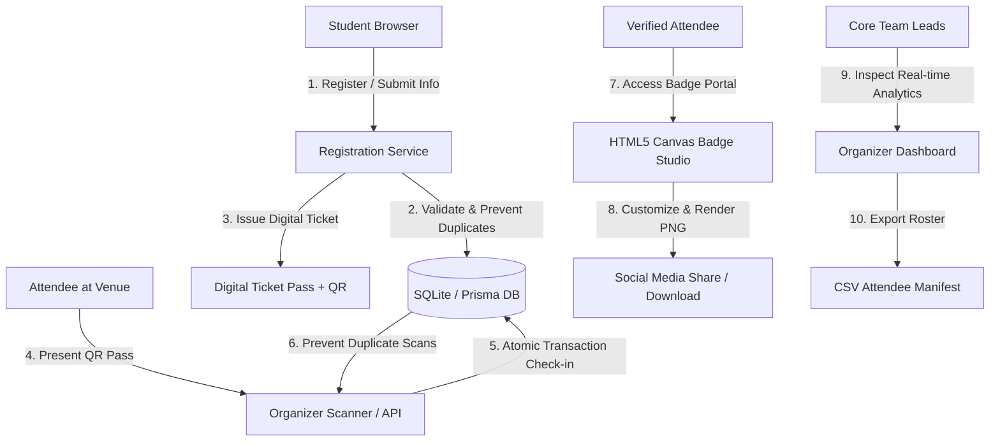

# 🛠️ GDG SVEC EventHub — Practical GDG Community Project (Track A)

**Project Name:** GDG SVEC EventHub  
**Track:** Track A — Event Check-In & Dynamic Social Badge Hub  
**Candidate Roll Number:** 23A81A4397  
**Evaluation Weight:** 35 Points  

---

## 📌 Problem Overview & Community Impact

During high-attendance workshops, study jams, and flagship DevFests hosted by **GDG on Campus SVEC**, manual attendee verification causes severe registration desk bottlenecks, long student queues, duplicate entry abuses, and chaotic paper manifests. Furthermore, attendees frequently request personalized, high-quality digital social badges to celebrate and broadcast their participation on LinkedIn, Twitter/X, and GitHub.

**GDG SVEC EventHub** solves these challenges end-to-end:
1. **Frictionless Student Registration & QR Pass Generation:** Instant digital pass creation with unique pass IDs (`TICK-GDG-XXXXXX`) and secure QR payloads.
2. **High-Speed Check-In Scanner & Duplicate Protection:** Rapid verification interface with atomic database transactions preventing concurrent duplicate check-ins.
3. **Interactive HTML5 Canvas Social Badge Hub:** Live client-rendered badge customizer with multiple developer tracks, gradient themes, and one-click high-resolution PNG export.
4. **Real-Time Organizer Telemetry & Analytics Dashboard:** Live attendance percentages, department distribution breakdown, recent check-in feeds, and instant CSV manifest exports.

---

## 🏗️ System Architecture & Data Flow



---

## 💾 Relational Data Model

The application uses a normalized relational schema backed by SQLite with strict foreign keys and uniqueness constraints:

```prisma
model Attendee {
  id          String   @id @default(uuid())
  fullName    String
  email       String   @unique
  rollNumber  String   @unique
  department  String
  year        String
  phone       String?
  registeredAt DateTime @default(now())
  ticket      Ticket?
}

model Ticket {
  id          String   @id // "TICK-GDG-XXXXXX"
  attendeeId  String   @unique
  attendee    Attendee @relation(fields: [attendeeId], references: [id], onDelete: Cascade)
  qrPayload   String   // "GDG-PASS:TICK-GDG-XXXXXX"
  status      String   @default("ISSUED") // "ISSUED" | "CHECKED_IN"
  issuedAt    DateTime @default(now())
  checkIn     CheckIn?
}

model CheckIn {
  id          String   @id @default(uuid())
  ticketId    String   @unique
  ticket      Ticket   @relation(fields: [ticketId], references: [id], onDelete: Cascade)
  scannedAt   DateTime @default(now())
  scannedBy   String   @default("ORGANIZER_DESK")
  deviceInfo  String?
}
```

---

## 🚀 Key Features Implemented

### 1. Registration & Ticket Issuance (`/register`)
- Validates student name, SVEC email, roll number, department (CSE, IT, ADS, ECE, EEE, MECH, CIVIL), and year.
- Rejects duplicate email or roll number registrations.
- Generates a unique, URL-safe ticket ID and renders the interactive pass card.

### 2. Digital Entry Pass (`/ticket/[ticketId]`)
- Displays official GDG DevFest 2026 pass card with venue details and rendered QR code.
- Live status indicator reflecting `"Pass Active"` or `"Checked In & Verified"`.

### 3. Organizer Check-In Desk (`/check-in`)
- Accepts raw QR pass scans or manual ticket ID / roll number lookups.
- Performs atomic database check-in:
  - **First Scan:** Returns `VALID_TICKET`, marks attendee present, and updates timestamp.
  - **Subsequent Scans:** Returns `ALREADY_CHECKED_IN` security alert with original check-in timestamp.
  - **Invalid Scans:** Returns `INVALID_TICKET`.

### 4. Dynamic HTML5 Canvas Social Badge Generator (`/badge/[ticketId]`)
- Interactive canvas rendering 600x800 high-res badge with attendee name, avatar initials, department, and pass ID.
- Customizable developer identities: *Student Developer, AI / ML Enthusiast, Cloud Architect, Web Explorer, Mobile Artisan, Community Lead*.
- 4 color palettes: *Google Indigo, Cyber Slate, Amber Pulse, Emerald AI*.
- Direct PNG download for LinkedIn / Twitter sharing.

### 5. Live Admin Dashboard & Telemetry (`/admin`)
- Real-time KPI summary: Total Registrations, Total Check-ins, Turnout Percentage.
- Department participation breakdown grid.
- Attendee directory search & filter.
- One-click CSV manifest export (`GET /api/export`).

---

## 📡 API Endpoint Reference

| Method | Endpoint | Description | Sample Payload / Response |
| :--- | :--- | :--- | :--- |
| `POST` | `/api/register` | Register new attendee & issue ticket | `{ "fullName": "...", "email": "...", "rollNumber": "...", "department": "CSE", "year": "2nd Year" }` |
| `GET` | `/api/ticket/:ticketId` | Fetch ticket and attendee details | `{ "success": true, "ticket": { "ticket_id": "...", "status": "ISSUED" } }` |
| `POST` | `/api/check-in` | Validate and check in ticket | `{ "ticketId": "TICK-GDG-XXXX", "scannedBy": "DESK_A" }` |
| `GET` | `/api/dashboard` | Fetch aggregated analytics & KPIs | `{ "totalRegistrations": 120, "totalCheckIns": 95, "attendancePercentage": 79.17 }` |
| `GET` | `/api/attendees` | Search attendee roster | `{ "attendees": [...] }` |
| `GET` | `/api/export` | Export full attendee manifest as CSV | Returns `text/csv` download stream |

---

## 💻 Local Setup, Installation & Execution Guide

Follow these step-by-step instructions to setup, install dependencies, run automated tests, and start the application locally:

### 1. Prerequisites
- Node.js (v18.0.0 or higher) and npm
- Python (v3.10 or higher)

### 2. Install Dependencies
```bash
# Navigate to Challenge 03 directory
cd assessment/challenge-03-practical

# Install Node.js dependencies
npm install

# (Optional) Setup environment variables
cp .env.example .env
```

### 3. Run Automated Tests
```bash
# Run Python backend integration & concurrency test suite
pytest tests/ -v

# Run TypeScript / Jest test suite
npm test
```

### 4. Start the Application Locally
```bash
# Start Next.js development server
npm run dev
```
Open [http://localhost:3000](http://localhost:3000) in your browser.

---

## 🔒 Security & Resilience Design

1. **Duplicate Check-In Defense:** Check-in queries execute inside strict atomic database transactions (`BEGIN TRANSACTION ... COMMIT`). Concurrent scan collisions are trapped via unique constraints on `check_ins.ticket_id`.
2. **Input Sanitization & Validation:** All user inputs are validated on both client and server boundaries. Email formats and roll numbers are normalized (trimmed and case-standardized) to prevent bypasses.
3. **Safe QR Payload:** QR codes contain only safe ticket identifiers (`GDG-PASS:TICK-GDG-XXXXXX`) and do not expose sensitive student contact numbers or passwords.
4. **Zero Hardcoded Secrets:** Configuration keys are read from environment templates (`.env.example`).

---

## ⚖️ Engineering Trade-offs & Decisions

1. **SQLite with Atomic Transactions vs External Database:** SQLite was chosen for zero-dependency portability and sub-millisecond local execution during campus events without requiring cloud network connectivity.
2. **Client-Side HTML5 Canvas vs Server-Side Image Generation:** Generating badges directly in the browser via HTML5 Canvas eliminates server rendering load, providing instant 60fps real-time visual customization and zero cloud egress cost.
