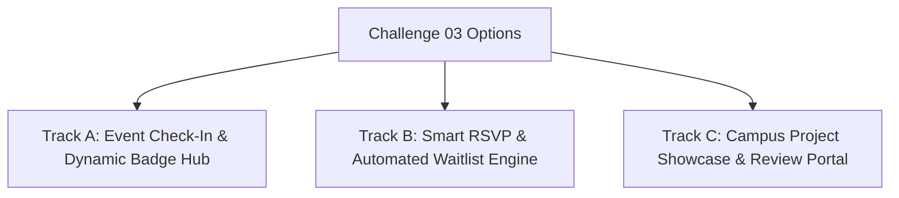

# 🛠️ Challenge 03 — Practical GDG Community Engineering Project
**Evaluation Weight:** 35 Points  
**Recommended Time:** 8 – 10 Hours  
**Deliverable:** Fully functional working project, clean codebase, architecture documentation, setup instructions, and optional live demo.

---

## 📌 Context: Building for the GDG on Campus Community

As a GDG on Campus Organizer at SVEC, you will build tools, platforms, and services that directly impact hundreds of student developers, event attendees, hackathon participants, and workshop mentors.

This challenge evaluates your ability to take a **real-world community problem from concept to working software**, demonstrating sound architectural choices, clean code, good UX/API design, and professional engineering ownership.

---

## 🎯 Choose Your Track

You may select **ONE** of the following three community projects to build:



---

### 🎟️ Track A: Event Check-In & Dynamic Social Badge Hub
*Ideal for candidates passionate about Full-Stack development, UX, and interactive web tools.*

**Problem:** For large GDG workshops, manual check-in creates massive queues at the hall entrance, and attendees want digital badges to share on LinkedIn/Twitter/Instagram.

**Core Requirements:**
1. **Attendee Registration & QR Pass:** Generate a unique ticket/QR code upon student registration.
2. **Organizer Check-in Scanner / API:** A rapid scanner interface or API endpoint that validates tickets, prevents duplicate check-ins, and marks attendance.
3. **Dynamic Social Badge Generator:** Allow verified attendees to customize and generate a downloadable/shareable personalized GDG attendee badge (using Canvas, SVG, or server-side image generation).
4. **Live Attendance Dashboard:** Display real-time attendance counts, check-in velocity, and department breakdowns.

---

### ⚡ Track B: Smart Workshop RSVP & Automated Waitlist Engine
*Ideal for candidates focusing on Backend, Distributed Systems, APIs, and Robust State Management.*

**Problem:** High-demand GDG workshops (e.g. Cloud Study Jams, Flutter Bootcamps) fill up within minutes. When registered students fail to show up, waitlisted students miss out.

**Core Requirements:**
1. **Capacity-Gated RSVP API:** Enforce strict seat caps with atomic reservation handling.
2. **Smart Waitlist & Timed Release:** When a registered user cancels, automatically promote the next waitlisted user and assign a time-limited claim window (e.g., 2 hours to confirm before expiring to the next person).
3. **Admin Controls & Batch Operations:** Endpoints to bulk-import attendees, broadcast status updates, and export attendee manifests in CSV/JSON format.
4. **Webhook Notification Dispatcher:** Trigger notifications (simulated or real Discord/Slack/Email webhooks) on registration, waitlist promotion, and cancellation.

---

### 💡 Track C: Student Project Showcase & Mentorship Review Portal
*Ideal for candidates interested in Platform Development, Content Management, and Community Engagement.*

**Problem:** After hackathons and study jams, student projects are often forgotten in disconnected GitHub repos. GDG needs a centralized showcase with structured feedback from core team mentors.

**Core Requirements:**
1. **Project Submission & GitHub Metadata:** Allow students to submit project details, tech stack tags, demo links, and GitHub repository URLs.
2. **Interactive Showcase Feed:** Filter and search projects by domain (AI/ML, Web, Mobile, Cloud, IoT), year, and tech stack.
3. **Structured Mentor Review System:** Organizers can evaluate submissions using a standardized rubric (Code Quality, Innovation, Completeness) with feedback comments.
4. **Leaderboard / Featured Projects:** Compute overall score rankings and highlight top community projects on the homepage.

---

## 🛠️ Technology Stack Freedom

You are **100% free to choose your tech stack**. Use the technologies you are most productive in:

- **Frontend:** React, Next.js, Vue, Nuxt, Svelte, Angular, Tailwind CSS, HTML5/Vanilla JS, Flutter Web.
- **Backend:** Node.js (Express/Fastify/NestJS), Python (FastAPI/Django/Flask), Go, Java/Kotlin (Spring Boot/Ktor), Rust.
- **Storage / Database:** SQLite, PostgreSQL, MongoDB, Redis, In-Memory Store, Firebase, Supabase, or JSON file persistence.
- **Packaging:** Docker / Docker Compose (Optional, but highly appreciated).

---

## 📦 Minimum Deliverables Checklist

- [ ] **Working Application Code:** Fully implemented frontend and/or backend in `assessment/challenge-03-practical/`.
- [ ] **Clear Setup Guide:** Exact step-by-step commands to install dependencies, run migrations, and start the app locally.
- [ ] **Environment Template:** `.env.example` with documented configuration keys (no real secrets!).
- [ ] **Architecture Overview:** A brief explanation (and optional diagram) in your project README explaining your data model, APIs, and component design.
- [ ] **Meaningful Git History:** Demonstrating steady, incremental progress through atomic commits.
- [ ] **Bonus / Optional:** Live deployed URL (Vercel, Netlify, Render, Railway, Fly.io, etc.).

---

## 📂 Recommended Directory Structure

```
assessment/challenge-03-practical/
├── README.md               # Project overview, setup guide & architecture notes
├── .env.example            # Sample configuration
├── package.json / requirements.txt / go.mod / Dockerfile
├── src/                    # Application source code
│   ├── frontend/           # (If applicable)
│   ├── backend/            # (If applicable)
│   └── ...
└── tests/                  # Project unit / integration tests
```

---

## ⚖️ Scoring Criteria (35 Points)

| Category | Points | Description |
| :--- | :---: | :--- |
| **Core Functionality & Completeness** | 12 | Working implementation of all selected track requirements without critical crashes. |
| **Architecture & System Design** | 8 | Clean separation of concerns, modular code structure, appropriate data modeling. |
| **API & Data Quality / UI UX** | 6 | Clean, well-structured REST/GraphQL APIs and intuitive, responsive user experience. |
| **Error Handling & Resilience** | 4 | Graceful handling of invalid inputs, network failures, and boundary conditions. |
| **Documentation & Developer Experience** | 3 | Flawless local setup instructions, architectural explanations, and clear environment templates. |
| **Deployment / Live Demo (Bonus)** | 2 | Live deployed preview or containerized Docker execution. |
