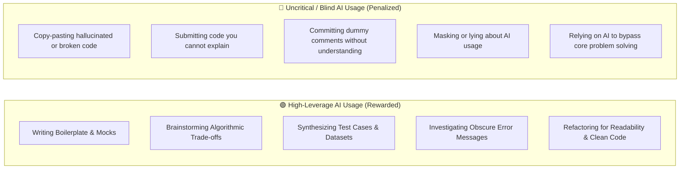

# 🤖 AI Assistance & Tooling Policy

> **Core Principle:** At GDG on Campus SVEC, we embrace the future of software engineering. Modern developers leverage AI tools to increase productivity, accelerate learning, and build better systems. We do not ban AI—we assess your ability to **use AI with engineering rigor, transparency, and deep understanding**.

---

## 🌟 Policy Summary

1. **AI Tools are Permitted:** You are welcome to use tools like Google Gemini, ChatGPT, Claude, GitHub Copilot, Cursor, etc., during the assessment.
2. **Mandatory Transparency:** You must document your use of AI in [`starter/AI_DISCLOSURE.md`](../starter/AI_DISCLOSURE.md).
3. **Total Technical Ownership:** You are 100% responsible for every line of code committed. If your code contains a security vulnerability, syntax error, hallucinated library, or anti-pattern produced by an AI tool, you bear full responsibility for that code.
4. **Interview Code Defense:** During Round 3 (Technical Interview), you will be asked to explain, modify, or debug sections of your submitted code in real time without AI assistance.

---

## ⚖️ The AI Spectrum: What We Value vs. What We Penalize

---

## 📋 Specific Guidelines for Each Assessment Challenge

### Challenge 01: Debugging & Root-Cause Analysis
- **Allowed:** Using AI to research concurrency edge cases, promise handling patterns, or timezone nuances.
- **Expectation:** The Root-Cause Analysis in `DEBUG_REPORT.md` must be written in your own words with specific reasoning tied to the provided codebase. Copy-pasted generic LLM summaries that miss the actual code context will receive low marks.

### Challenge 02: Coding & Problem Solving
- **Allowed:** Using AI for syntax lookups, topological sorting boilerplate, or regex patterns.
- **Expectation:** The scheduling algorithm must handle all 5 hard constraints correctly. LLMs frequently produce code that hallucinates edge-case support while failing on circular dependencies or room capacity boundary conditions. You must write the unit tests that verify correctness.

### Challenge 03: Practical GDG Engineering Project
- **Allowed:** Using AI to scaffold frontend components, generate CSS/Tailwind styles, create mock JSON feeds, or write Dockerfiles.
- **Expectation:** The application must integrate cleanly and run locally following your setup guide. You must understand the data flow, architecture, and API design.

---

## 📝 How to Complete the AI Disclosure Log

Before submitting your repository, fill out [`starter/AI_DISCLOSURE.md`](../starter/AI_DISCLOSURE.md):

1. **Select Tools Used:** Check off Gemini, ChatGPT, Claude, Copilot, etc.
2. **List Key Prompts & Iterations:** Include 2–3 examples of prompts you used, what the model suggested, and how you adapted or corrected that output.
3. **Reflect on Hallucinations & Corrections:** Describe at least one instance where an AI model gave you an incorrect, incomplete, or sub-optimal suggestion, and how you caught and fixed it.

---

## ❓ Frequently Asked Questions

<strong>Will I get a lower score if I admit to using AI?</strong>

<strong>No!</strong> Transparent, thoughtful disclosure earns full points in the "Technical Explanation & AI Mastery" rubric dimension. Dishonesty or claiming zero AI usage on obviously AI-generated code will result in severe score penalties.

<strong>What happens if I cannot explain code in the interview?</strong>

If an evaluator asks you why a specific data structure or function was used in your submission and you cannot explain its purpose or how it works, your score for that challenge will be downgraded, regardless of whether the code compiles.

---

  
<em>Use AI to amplify your intellect, not to replace it. Happy building!</em>

