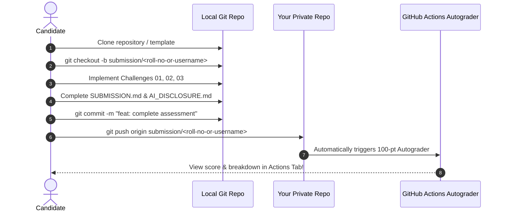

# 📘 GDG on Campus SVEC 4.0 — Candidate Assessment Guide

Welcome, applicant! We are thrilled that you are taking this step toward becoming an Organizer for **GDG on Campus SVEC 4.0**. 

This comprehensive guide contains everything you need to know about the technical assessment, workflow expectations, submission rules, and evaluation criteria.

---

## 🎯 Purpose of the Assessment

GDG on Campus organizers are community builders and practical engineers. We build software tools, organize technical workshops, lead hackathons, and mentor fellow students. 

This assessment is designed to see how you:
- Approach real-world debugging and architecture problems.
- Structure and document software solutions.
- Utilize modern developer tools and AI responsibly.
- Maintain professional Git/GitHub practices.

---

## ⏱️ How the 24-Hour Submission Window Works

1. **Window Duration:** You have exactly **24 hours** to complete and submit your assessment from the moment the assessment round begins or you accept your repository invitation.
2. **Time Management:** The assessment is sized to take **12 – 16 hours of focused work**, allowing ample time for meals, rest, and code refinement.
3. **Commit Timestamps:** All Git commits must be pushed before the 24-hour mark expires. Late submissions will receive deductions or may not be evaluated.

---

## 🚀 Step-by-Step Candidate Workflow



### Step 1: Clone Your Repository
Clone your assigned or instantiated repository locally:
```bash
git clone <your-repository-url>
cd gdgoc-organiser-recruitment
```
Verify that your local environment has the runtimes you need (Node.js, Python, Go, Java, Docker, etc.).

### Step 2: Create Your Dedicated Candidate Branch
Create and switch to a dedicated submission branch named after your **college roll number or GitHub username**:
```bash
git checkout -b submission/<your-roll-no-or-username>
```
*Examples:*
- `git checkout -b submission/22ec101`
- `git checkout -b submission/alex-chen`

### Step 3: Implement the Challenges
Navigate to each challenge directory and complete the tasks:
- **[Challenge 01 (Debugging & RCA)](../assessment/challenge-01-debugging/README.md):** 
  - Diagnose the bugs in the event dispatcher.
  - Complete `assessment/challenge-01-debugging/DEBUG_REPORT.md` (using the template in `starter/DEBUG_REPORT_TEMPLATE.md`).
  - Fix the code and add regression tests.
- **[Challenge 02 (Coding & Problem Solving)](../assessment/challenge-02-coding/README.md):** 
  - Implement the conference session scheduling engine.
  - Handle all 5 hard constraints and edge cases.
  - Write unit tests.
- **[Challenge 03 (Practical Project)](../assessment/challenge-03-practical/README.md):** 
  - Choose one track (Badge Hub, RSVP/Waitlist Engine, or Project Showcase).
  - Build a working solution with clean architecture and clear local setup instructions.

### Step 4: Complete Documentation & AI Disclosures
1. Fill in [`starter/SUBMISSION.md`](../starter/SUBMISSION.md) with your details, tech stack, architectural choices, and self-reflection.
2. Fill in [`starter/AI_DISCLOSURE.md`](../starter/AI_DISCLOSURE.md) documenting all AI tools, prompts, and verification steps used.

### Step 5: Test Locally & Push Your Branch
You can test your score locally anytime before pushing:
```bash
python3 evaluation/autograder/evaluator.py
```

When you are ready, commit and push your branch directly:
```bash
git add .
git commit -m "feat(submission): complete GDG 4.0 technical assessment"
git push -u origin submission/<your-roll-no-or-username>
```

### Step 6: Instant Automated Grading
> [!NOTE]
> **No Pull Request or merge to `main` is required!**  
> As soon as you push your branch, GitHub Actions automatically runs the **100-Point Autograder Pipeline**. Navigate to the **Actions** tab on your GitHub repository to view your instant scorecard and detailed feedback report.

---

## 📂 Expected Repository Structure

Ensure your repository preserves this structure:

```
├── README.md
├── starter/
│   ├── SUBMISSION.md          # Completed submission dossier
│   ├── AI_DISCLOSURE.md       # Completed AI disclosure
│   └── ...
├── assessment/
│   ├── challenge-01-debugging/
│   │   ├── DEBUG_REPORT.md    # Completed RCA report
│   │   ├── src/               # Fixed code
│   │   └── tests/             # Regression tests
│   ├── challenge-02-coding/
│   │   ├── src/               # Scheduling engine
│   │   └── tests/             # Unit test suite
│   └── challenge-03-practical/
│       ├── README.md          # Project setup & architecture guide
│       ├── .env.example       # Sample environment template
│       ├── src/               # Application code
│       └── tests/             # Application tests
```

---

## ✅ What is Allowed vs. 🚫 What is Prohibited

| Category | ✅ Allowed | 🚫 Strictly Prohibited |
| :--- | :--- | :--- |
| **Tooling & AI** | Using Gemini, ChatGPT, Claude, GitHub Copilot, Cursor, StackOverflow, official docs. | Copy-pasting unverified AI output that you cannot explain or defend during the interview. |
| **Libraries & Frameworks** | Using open-source packages (Express, React, FastAPI, Pytest, Jest, Tailwind, etc.). | Downloading pre-built complete clone templates of the entire challenge. |
| **Tech Stack** | Selecting whatever language/stack you are most proficient in. | Submitting code that does not compile, run, or have setup instructions. |
| **Collaboration** | Independent individual work. | Sharing solutions, collaborating with other candidates, or hiring third parties. |
| **Secrets & Keys** | Mock data, `.env.example` templates with dummy keys. | Committing real API keys, production database passwords, or personal credentials. |

---

## ⚖️ How Your Submission Will Be Evaluated

Submissions are scored on a **100-point scale** across eight dimensions:
1. **Challenge 01 (Debugging & RCA):** 15 Points
2. **Challenge 02 (Coding & Algorithms):** 20 Points
3. **Challenge 03 (Practical Engineering):** 35 Points
4. **Code Quality & Modularity:** 10 Points
5. **Git & GitHub Practices:** 5 Points
6. **Documentation & Clarity:** 5 Points
7. **Testing & Coverage:** 5 Points
8. **Technical Explanation & AI Mastery:** 5 Points

*Read the complete scoring matrix in [evaluation/RUBRIC.md](../evaluation/RUBRIC.md).*

---

## 🛡️ Security & Privacy Notice

> [!CAUTION]
> **Do NOT commit any private credentials or sensitive personal information.**
> - Use `.env.example` with placeholder strings (e.g. `API_KEY=your_key_here`).
> - Do not upload real Google Cloud Service Account JSON files, private RSA/SSH keys, or confidential tokens.
> - Ensure all test data uses fictional student names and emails.

---

## ❓ Frequently Asked Questions (FAQ)

<details>
<summary><strong>Q: What if I don't finish all three challenges within 24 hours?</strong></summary>
Submit whatever you have completed! Partial submissions are evaluated fairly based on the quality, architecture, and documentation of the completed portions. Clearly explain what is pending in the "Known Limitations" section of `SUBMISSION.md`.
</details>

<details>
<summary><strong>Q: Am I penalized for using AI tools?</strong></summary>
No! We encourage modern developer tooling. You are evaluated on how well you verify, adapt, test, and explain the code. Full transparency in `AI_DISCLOSURE.md` earns maximum points.
</details>

<details>
<summary><strong>Q: Can I use TypeScript instead of JavaScript, or Python instead of Go?</strong></summary>
Yes! You have complete freedom of language and tech stack for all challenges.
</details>

<details>
<summary><strong>Q: Do I need to deploy Challenge 03 to a live URL?</strong></summary>
A live deployment is an optional bonus (2 points). As long as clear local setup instructions are provided in `assessment/challenge-03-practical/README.md`, you can achieve full points.
</details>

---

<div align="center">
  <p>Good luck! We look forward to reviewing your engineering craftsmanship and welcoming you to the <strong>GDG on Campus SVEC 4.0</strong> team.</p>
</div>
