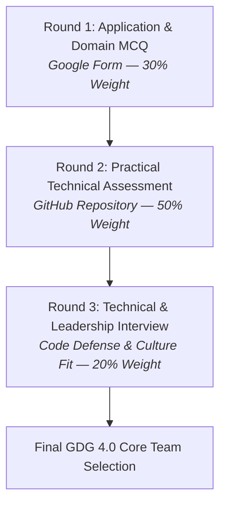

# 📋 GDG on Campus SVEC 4.0 — Organizer Operations Manual

> **Internal Operations Guide:** This handbook outlines logistics, release workflows, repository management, and evaluation coordination for the GDG on Campus SVEC 3.0 Core Team conducting 4.0 recruitment.

---

## 🎯 Recruitment Architecture

The organizer selection process for GDG on Campus SVEC 4.0 is structured into three progressive evaluation rounds:



*This repository manages and automates **Round 2: Practical Technical Assessment**.*

---

## 🚀 Repository Distribution Strategies

Depending on team preference and tooling, choose one of the following two deployment methods:

### Option A: GitHub Classroom (Recommended)
1. Create a GitHub Classroom assignment linked to the `gdgoc-svec` organization.
2. Set this repository as the **Starter Code Template**.
3. Configure settings:
   - **Repository visibility:** Private (candidates cannot see peers' code).
   - **Deadline:** Set exact 24-hour cutoff timestamp.
   - **Automated feedback:** Enabled (runs `.github/workflows/` on each push).
4. Share the single Classroom invitation URL with shortlisted candidates.

### Option B: GitHub Template Repository
1. In this repository's settings, check **"Template repository"**.
2. Candidates click **"Use this template"** $\to$ **"Create a new repository"** (Private).
3. Candidates add `gdgoc-svec-evaluators` or specific organizer handles as collaborators.
4. Candidates submit their repository URL via a confirmation form before the 24-hour deadline.

---

## ⏱️ Managing the 24-Hour Assessment Window

### 1. Launch Announcement Checklist
- [ ] Ensure all challenge READMEs and workflows are up to date on `main`.
- [ ] Confirm no secrets, solutions, or broken links exist.
- [ ] Send candidate announcement email with:
  - Exact Start Time & Deadline (IST).
  - Link to repository / GitHub Classroom.
  - Link to [docs/CANDIDATE_GUIDE.md](CANDIDATE_GUIDE.md).
  - Link to [docs/AI_USAGE_POLICY.md](AI_USAGE_POLICY.md).
  - Emergency contact channel for technical blockers.

### 2. Live Monitoring & Triage
- Assign core team members in 4-hour shifts to monitor repository [Issues](https://github.com/gdgoc-svec/gdgoc-organiser-recruitment/issues).
- If a genuine bug in starter code is identified, push a hotfix to `main` and announce the patch immediately.
- Enforce strict anti-collaboration policies.

### 3. Submission Cutoff Enforcement
- At the 24-hour mark:
  - If using GitHub Classroom, lock student repositories automatically.
  - If using manual repos, record the commit SHA corresponding to the timestamp cutoff:
    ```bash
    git log --before="2026-09-08 12:00:00" -n 1 --format="%H"
    ```
  - Commits pushed significantly after the deadline should be flagged for penalty.

---

## 📊 Score Normalization & Master Spreadsheet Integration

Maintain a centralized candidate tracking sheet with the following columns:

| Candidate ID | Name | Department / Year | Part 1 MCQ (30) | GitHub Practical (100) | Normalized Practical (50) | Total Prelim Score (80) | Interview Status |
| :---: | :---: | :---: | :---: | :---: | :---: | :---: | :---: |
| GDG-01 | ... | CSE / 3rd | 26 / 30 | 88 / 100 | 44 / 50 | 70 / 80 | Shortlisted |
| GDG-02 | ... | IT / 2nd | 24 / 30 | 92 / 100 | 46 / 50 | 70 / 80 | Shortlisted |

### Formula:
$$\text{Prelim Score} = \text{MCQ Score (out of 30)} + \left(\frac{\text{GitHub Practical Score (out of 100)}}{2}\right)$$

---

## 🎙️ Round 3: Technical Interview & Code Defense

Candidates scoring above the qualification threshold ($\ge 65/80$) advance to the Technical Interview.

### 20-Minute Interview Format:
1. **Introduction & Motivation (3 mins):** Why GDG on Campus? What vision do they have for SVEC 4.0?
2. **Code Walkthrough & RCA Defense (7 mins):**
   - Candidate shares screen and walks through their fix in Challenge 01 and algorithm in Challenge 02.
   - Evaluator asks probing questions from [evaluation/EVALUATOR_GUIDE.md](../evaluation/EVALUATOR_GUIDE.md).
3. **Challenge 03 System Architecture & Live Demo (6 mins):**
   - Candidate demos the working application.
   - Discuss database design, concurrency bottlenecks, and scaling strategy.
4. **AI Tooling & Learning Reflection (2 mins):**
   - Review `AI_DISCLOSURE.md` entries and verify how generated code was audited.
5. **Candidate Questions (2 mins):** Open floor for the candidate.

---

## 🏆 Final Selection & Role Allocation

After interviews, the GDG 3.0 Lead convenes a final consensus meeting to assign roles for 4.0:
- **Lead / Co-Lead**
- **Technical Lead (Web / Mobile / Cloud / AI)**
- **Operations & Event Logistics Lead**
- **Community & Design Lead**
- **Public Relations & Outreach Lead**

---

<div align="center">
  <p><em>GDG on Campus SVEC — Empowering the next generation of student developers.</em></p>
</div>
