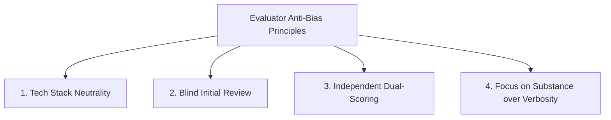
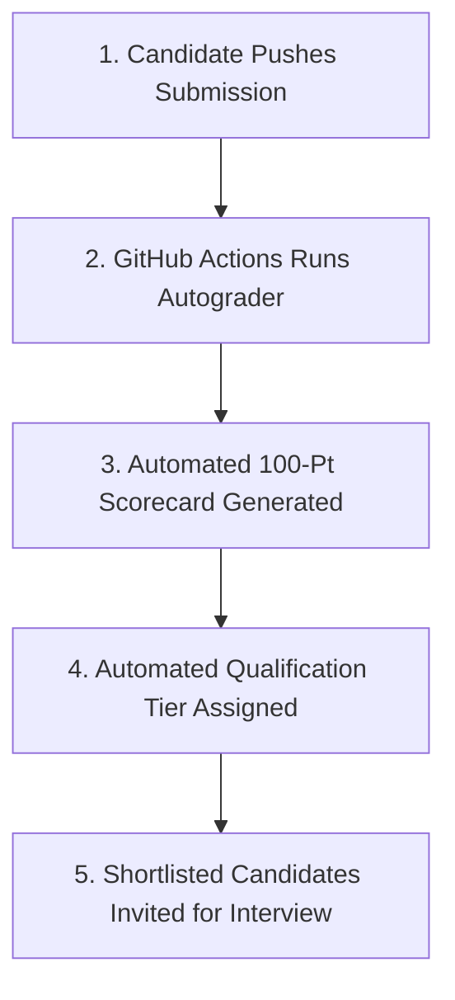

# 🧑‍⚖️ GDG on Campus SVEC 4.0 — Evaluator & Reviewer Guide

> **Confidential Document:** This guide is intended exclusively for the outgoing GDG on Campus SVEC 3.0 Lead and Core Team evaluators.

---

## 🎯 Evaluation Philosophy & Objectives

As evaluators, your goal is to select candidates who will carry forward **GDG on Campus SVEC 4.0** with passion, technical excellence, resilience, and community spirit.

We are **not** looking for competitive programming savants who write cryptic one-liners; we are looking for **future technical organizers**:
1. **Engineering Ownership:** Do they write clean, maintainable, production-ready code that teammates can read and extend?
2. **Problem Solving:** Can they diagnose real-world production issues, architect systems, and handle complex requirements?
3. **Communication & Documentation:** Can they clearly explain *why* they made architectural choices?
4. **Tool Mastery:** Do they leverage modern tools (including AI) responsibly and critically, without being blind consumers?

---

## 🛡️ Mitigating Cognitive Bias in Assessment

To ensure a fair, meritocratic, and unbiased recruitment process:



### 1. Tech Stack Neutrality
- **Do not penalize** a candidate simply because they chose Python over Rust, or Vue over Next.js.
- Evaluate the **depth of understanding, architecture, and code quality within their chosen stack**.

### 2. Guarding Against the "Halo Effect"
- If a candidate had an impressive resume or Google Form MCQ score, do not automatically inflate their GitHub practical score. Evaluate the code strictly against [evaluation/RUBRIC.md](RUBRIC.md).
- Conversely, if a candidate struggled in one specific sub-task, do not penalize their entire project if their overall architecture is solid.

### 3. Seniority & Year Neutrality
- Evaluate 2nd-year and 3rd-year applicants against standard rubric criteria. A 2nd-year student demonstrating high learning agility and solid fundamentals should be recognized.

### 4. Dual-Evaluator Calibration
- Each candidate's submission should be independently scored by at least **two** core team evaluators. If the two total scores differ by more than **10 points**, hold a calibration sync to review discrepancies.

---

## ⚡ Automated 100-Point Evaluation Engine (Zero Manual Effort)

This repository includes a fully automated **Autograder Pipeline** that scores candidate submissions automatically across all 8 rubric dimensions upon every commit, pull request, or local run.

### How Automated Evaluation Works:
1. **GitHub Actions Automation (`.github/workflows/auto-evaluate.yml`):**
   - Automatically executes whenever a candidate pushes code or creates a PR.
   - Computes an objective score out of **100 Points** matching `RUBRIC.md`.
   - Posts a rich visual scorecard into the **GitHub Step Summary** and attaches `evaluation_report.json` and `EVALUATION_REPORT.md` as downloadable artifacts.
2. **Local Organizer Execution:**
   - Evaluators can grade any candidate's repository locally in 3 seconds by running:
     ```bash
     python3 evaluation/autograder/evaluator.py
     ```
   - Automatically generates the candidate's score, breakdown, tier classification, and shortlisting recommendation.

---

## 📋 Step-by-Step Evaluation Workflow



### Step 1: CI Workflows & Security Verification
- Check GitHub Actions tab for the candidate's repository/PR:
  - Did `.github/workflows/validate-submission.yml` pass?
  - Did the code quality and test runner pass?
  - Are there any leaked `.env` files or secret keys? *(If secrets are found, request immediate redaction and deduct 2 points from Git practices).*

### Step 2: Git History & Commit Cadence Audit
- Review the commit log:
  ```bash
  git log --oneline --graph
  ```
- Look for incremental, atomic commits with informative messages.
- Be wary of single "Initial commit" containing 5,000 lines of code pushed 5 minutes before the deadline without prior history.

### Step 3: Challenge 01 Review (Debugging & RCA — 15 Pts)
- Read `assessment/challenge-01-debugging/DEBUG_REPORT.md`.
- Verify:
  - Did they identify the root causes (shared mutable state, async error swallowing, timezone offset, retry mechanism)?
  - Does their code eliminate race conditions?
  - Do their unit tests actually test concurrent execution and failures?

### Step 4: Challenge 02 Review (Coding & Algorithms — 20 Pts)
- Inspect `assessment/challenge-02-coding/`.
- Verify:
  - Did they satisfy all 5 constraints (speaker overlap, prerequisites, room capacity, window bounds, cycle detection)?
  - How did they handle cyclic dependencies ($A \to B \to A$)? Did they use topological sorting / DFS cycle detection?
  - Run their unit test suite locally or check CI results.

### Step 5: Challenge 03 Review (Practical Project — 35 Pts)
- Inspect `assessment/challenge-03-practical/`.
- Follow the candidate's setup instructions in their README.
- Verify:
  - Does the project boot up cleanly without obscure crashes?
  - Is the architecture modular (controllers, services, clean components)?
  - Are error boundaries and form validations handled gracefully?
  - Bonus: If a live demo URL is provided, test responsiveness and interactions.

### Step 6: Documentation & AI Disclosure Audit (15 Pts across Categories 4, 6, 8)
- Read `SUBMISSION.md` and `AI_DISCLOSURE.md`.
- Evaluate self-awareness, technical trade-off reasoning, and transparency.

---

## 🤖 Evaluating AI Usage: True Mastery vs. Uncritical Copy-Paste

GDG on Campus SVEC encourages modern AI tooling. However, we evaluate how well the candidate **steers and validates** the tools:

| Quality Indicator | 🟢 High Mastery (Award Full Points) | 🔴 Uncritical Copy-Paste (Deduct Points) |
| :--- | :--- | :--- |
| **Code Consistency** | Cohesive style matching throughout the repo; clear variable naming matching project domain. | Inconsistent naming schemes, mismatched patterns across files, unused imported libraries. |
| **Comments & Documentation** | Precise, domain-specific comments explaining *why* a design was chosen. | Generic AI generated comments (e.g. `// this function takes an integer and returns a boolean`). |
| **Error Handling** | Thoughtful error handling tailored to the specific GDG edge cases. | Boilerplate catch blocks that log `console.log(e)` or ignore errors. |
| **AI Disclosure** | Detailed prompts, critical review notes, and explanations of what was corrected. | Blank disclosure, or claiming zero AI was used despite obvious LLM hallmark idioms. |

---

## 🎤 Interview Probing Questions (For Technical Round)

Use these questions during the candidate's technical interview to verify comprehension:

1. *"In Challenge 01, what was the fundamental reason why parallel requests were colliding? How would your fix behave under 10,000 requests per second?"*
2. *"In Challenge 02, how did your algorithm detect circular dependencies? What is the Big-O time and space complexity of your approach?"*
3. *"In Challenge 03, if you had to scale your application to support 5,000 concurrent students during DevFest check-in, what would be the first bottleneck, and how would you re-architect it?"*
4. *"Walk us through an interesting prompt or failure mode you encountered with your AI assistant during this assessment. How did you verify the generated code?"*

---

## 📊 Score Normalization Template

Evaluators should record candidate scores in the following format:

```text
Candidate Name: _______________________
GitHub Handle: ________________________
Evaluator Name: _______________________

1. Challenge 01 (Debugging & RCA)       [ /15]
2. Challenge 02 (Coding & Algorithms)   [ /20]
3. Challenge 03 (Practical Project)     [ /35]
4. Code Quality & Modularity            [ /10]
5. Git & GitHub Practices               [ /5 ]
6. Documentation & Clarity              [ /5 ]
7. Automated Testing & Coverage         [ /5 ]
8. Technical Explanation & AI Mastery   [ /5 ]

Total Score:                            [ /100]

Recommendation:
[ ] Strongly Recommend for Core Team Lead
[ ] Recommend for Core Team Organizer
[ ] Consider for Associate / Extended Team
[ ] Do Not Recommend

Evaluator Notes:
_________________________________________________________________________
```
