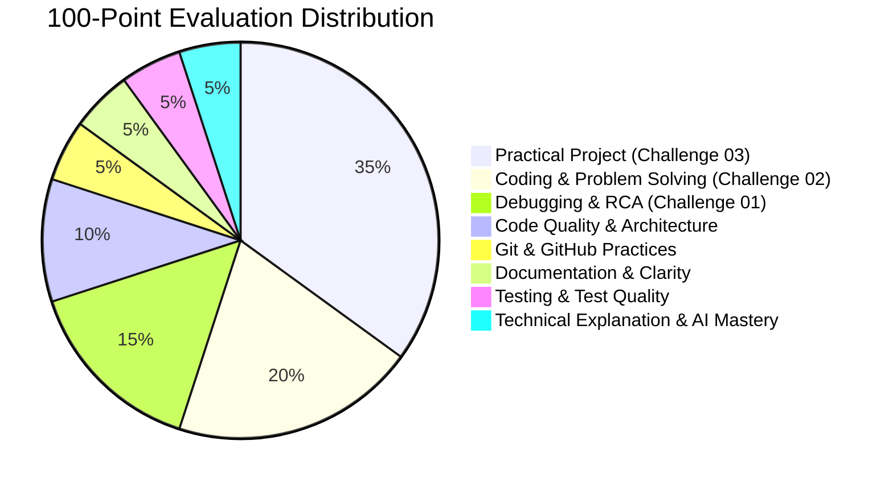

# ⚖️ GDG on Campus SVEC 4.0 — Technical Assessment Rubric (100 Points)

This rubric establishes an objective, transparent, and multi-dimensional standard for evaluating candidate submissions.

---

## 📊 High-Level Scoring Breakdown

| Dimension | Max Points | Category Focus |
| :--- | :---: | :--- |
| **1. Challenge 01: Debugging & Root-Cause Analysis** | **15** | Diagnosing concurrency bugs, error swallowing, state leakage, and regression testing. |
| **2. Challenge 02: Coding & Problem Solving** | **20** | Algorithmic logic, graph/dependency resolution, capacity constraints, computational complexity. |
| **3. Challenge 03: Practical Engineering Project** | **35** | Real-world GDG project completeness, architecture, API/UI design, and system reliability. |
| **4. Code Quality & Modularity** | **10** | Readability, naming conventions, separation of concerns, clean code principles, linters. |
| **5. Git & GitHub Practices** | **5** | Atomic commit history, meaningful commit messages, branch naming, PR conventions. |
| **6. Documentation & Developer Experience** | **5** | Readme completeness, reproduction/setup instructions, decision records in `SUBMISSION.md`. |
| **7. Testing & Coverage** | **5** | Meaningful automated unit/integration tests, negative testing, assertion depth. |
| **8. Technical Explanation & AI Mastery** | **5** | Transparency in `AI_DISCLOSURE.md`, deep comprehension, ability to justify design choices. |
| **Total Score** | **100** | |

---

## 🔍 Detailed Scoring Framework & Performance Tiers

### Tier Definitions:
- **🌟 Excellent (90% – 100% of category points):** Industry-grade execution; deeply reasoned; handles subtle edge cases; exemplary documentation.
- **👍 Good (75% – 89% of category points):** Functional and well-structured; minor omissions in edge cases or documentation; clear technical understanding.
- **⚠️ Average (50% – 74% of category points):** Partially working; basic requirements met but lacks polish, tests, or error resilience.
- **❌ Weak (< 50% of category points):** Incomplete, broken core logic, copy-pasted code without comprehension, or missing critical sections.

---

### 1. Challenge 01 — Debugging & Root-Cause Analysis (15 Points)

| Tier | Score Range | Criteria & Indicators |
| :--- | :---: | :--- |
| **Excellent** | 14 – 15 | Identifies all root causes (shared mutable state, async unhandled rejections, timezone/ISO issues, missing backoff). Produces clean fix and thorough regression test suite proving resolution. Complete `DEBUG_REPORT.md`. |
| **Good** | 11 – 13 | Identifies main concurrency/error flaws; fix resolves primary symptoms; basic regression tests present; clear RCA report. |
| **Average** | 8 – 10 | Fixes surface bugs (e.g., date parsing) but misses deeper race conditions or retry edge cases; minimal testing. |
| **Weak** | 0 – 7 | Incomplete fix; crashes under concurrent load; missing or superficial `DEBUG_REPORT.md`. |

---

### 2. Challenge 02 — Coding & Problem Solving (20 Points)

| Tier | Score Range | Criteria & Indicators |
| :--- | :---: | :--- |
| **Excellent** | 18 – 20 | Satisfies all 5 hard constraints (no speaker overlaps, prerequisites with cycle detection, room capacity, window bounds, buffer times). Efficient algorithmic complexity ($O(N \log N)$ or optimal polynomial). Exhaustive unit tests. |
| **Good** | 15 – 17 | Satisfies primary constraints; handles standard inputs cleanly; minor edge case oversights (e.g., complex multi-node cycles); decent test coverage. |
| **Average** | 10 – 14 | Basic greedy scheduling works, but fails on prerequisite dependencies, capacity bounds, or cyclic dependency graphs. Incomplete test suite. |
| **Weak** | 0 – 9 | Inverted logic, infinite loops on cycles, hardcoded mocks, or failing basic scheduling rules. |

---

### 3. Challenge 03 — Practical Engineering Project (35 Points)

| Tier | Score Range | Criteria & Indicators |
| :--- | :---: | :--- |
| **Excellent** | 32 – 35 | End-to-end working application for chosen track. Clean architecture (modular controllers/services/components). Responsive UI or clean REST/GraphQL APIs. Error handling, input validation, setup instructions, and optional live demo/Docker. |
| **Good** | 26 – 31 | Working MVP fulfilling core track features. Clear structure with minor UX or API rough edges. Flawless local setup instructions. |
| **Average** | 18 – 25 | Partial implementation with some working screens/endpoints, but missing key integrations or crashing on invalid inputs. |
| **Weak** | 0 – 17 | Static non-functional skeleton, broken database/backend, missing instructions to run locally. |

---

### 4. Code Quality & Modularity (10 Points)

| Tier | Score Range | Criteria & Indicators |
| :--- | :---: | :--- |
| **Excellent** | 9 – 10 | Idiomatic code; consistent formatting; clear variable/function naming; single responsibility principle; zero dead/commented-out code. |
| **Good** | 7 – 8 | Well-organized; mostly idiomatic with minor stylistic inconsistencies. |
| **Average** | 5 – 6 | Monolithic files; magic numbers; repetitive code; inconsistent naming. |
| **Weak** | 0 – 4 | Unreadable code; spaghetti logic; unformatted AI copy-paste dumps. |

---

### 5. Git & GitHub Practices (5 Points)

| Tier | Score Range | Criteria & Indicators |
| :--- | :---: | :--- |
| **Excellent** | 5 | Clean, frequent atomic commits with conventional commit messages (`feat:`, `fix:`, `docs:`, `test:`). Proper branch usage (`submission/<username>`). Clean git history with no stray artifacts. |
| **Good** | 4 | Several meaningful commits reflecting actual progress; reasonable commit messages. |
| **Average** | 2 – 3 | Only 1 or 2 large "dump" commits at the very end; generic commit messages (`update`, `commit`). |
| **Weak** | 0 – 1 | Single commit of entire codebase; committed secrets, `.env`, or `node_modules`. |

---

### 6. Documentation & Developer Experience (5 Points)

| Tier | Score Range | Criteria & Indicators |
| :--- | :---: | :--- |
| **Excellent** | 5 | Fully filled `SUBMISSION.md`, clear setup guide that runs on first attempt, documented `.env.example`, concise architectural decision notes. |
| **Good** | 4 | Complete `SUBMISSION.md` with working setup instructions; minor gaps in architectural explanations. |
| **Average** | 2 – 3 | Partially filled submission template; ambiguous setup steps requiring evaluator debugging. |
| **Weak** | 0 – 1 | Blank or missing `SUBMISSION.md`; no instructions on how to run code. |

---

### 7. Testing & Coverage (5 Points)

| Tier | Score Range | Criteria & Indicators |
| :--- | :---: | :--- |
| **Excellent** | 5 | Thoughtful unit and integration tests across challenges; positive and negative test cases; meaningful assertions (no fake `assert(true)`). |
| **Good** | 4 | Decent test coverage for main happy paths and key edge cases. |
| **Average** | 2 – 3 | Minimal tests with trivial assertions or only testing one happy path. |
| **Weak** | 0 – 1 | Zero tests written, or broken test suites that do not compile. |

---

### 8. Technical Explanation & AI Mastery (5 Points)

| Tier | Score Range | Criteria & Indicators |
| :--- | :---: | :--- |
| **Excellent** | 5 | Fully transparent `AI_DISCLOSURE.md`; clear record of human validation and refactoring; deep understanding of trade-offs articulated in `SUBMISSION.md`. |
| **Good** | 4 | Transparent disclosure log; demonstrates understanding of code and tools used. |
| **Average** | 2 – 3 | Generic disclosure log; weak articulation of why specific design decisions were made. |
| **Weak** | 0 – 1 | Undisclosed AI generation, evident lack of comprehension of submitted code, or unverified hallucinations. |

---

## 🎯 Benchmark Thresholds for Organizer Shortlisting

- **Top Tier (85 – 100 Points):** Exceptional technical leader; recommended for Technical Lead / Senior Core roles.
- **Qualified Tier (70 – 84 Points):** Strong practical engineer; recommended for Core Team Organizer roles.
- **Developmental Tier (50 – 69 Points):** Promising candidate; eligible for Associate / Extended Core roles based on interview.
- **Below Threshold (< 50 Points):** Does not meet minimum technical criteria for 4.0 Core Team.
